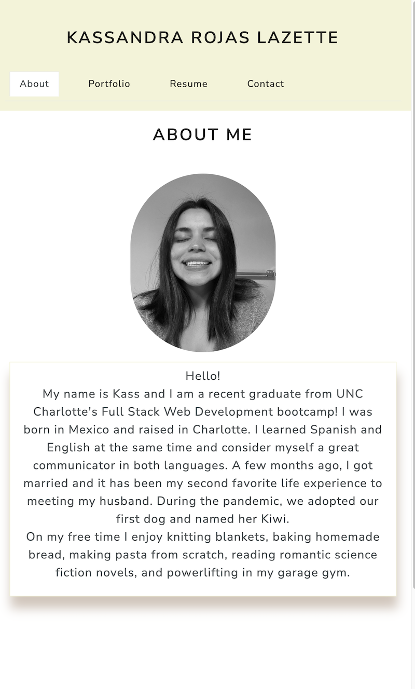

# React Portfolio

## Description

This single page application uses React to render About Me, Resume, Contact, and Portfolio components. They provide the user with highlighted applications created over the course of this 12 week coding bootcamp.

## Table of Contents

- [Technologies](#technologies)
- [Visuals](#visuals)
- [License](#license)
- [Questions](#questions)

## Technologies

`React JS` to build UI

## Visuals

## License

This project is licensed under the MIT.
For license notice, please click on the license badge at the top of this readme file or here: 

## Questions

If you have any other questions, please visit my [GitHub repository](https://github.com/kassrojas/kass-portfolio-react).
